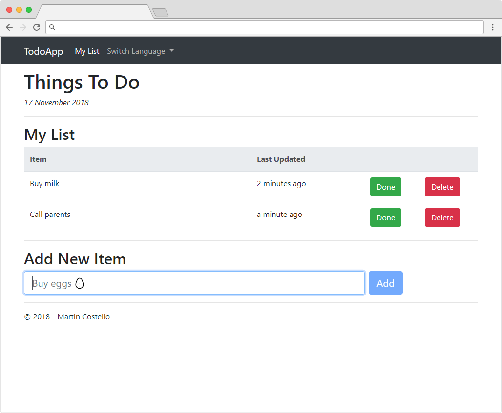
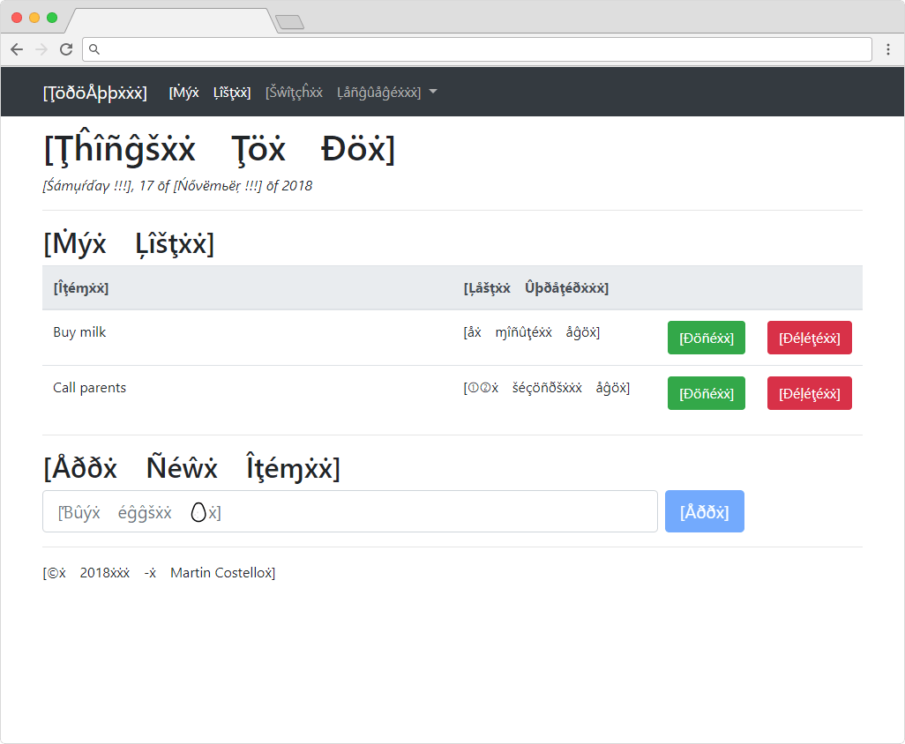

# ASP.NET Core Pseudo-localization

[](https://github.com/martincostello/aspnet-core-pseudo-localization/actions?query=workflow%3Abuild+branch%3Amaster+event%3Apush)

[](https://dev.azure.com/martincostello/aspnet-core-pseudo-localization/_build/latest?definitionId=71)

[](https://dev.azure.com/martincostello/aspnet-core-pseudo-localization/_build?definitionId=71)

## Introduction

An example application that demonstrates using pseudo-localization with ASP.NET Core for testing that strings shown in the user interface have been appropriately prepared for localization.

### English (`en-GB`)

Below is the sample application when run in the default locale (UK English).



### Pseudo-locale (`qps-Ploc`)

Below is the sample application when run using the Windows base pseudo-locale. UI elements that are not user data are rendered using with additional length, accents and surrounded in square brackets.



## Feedback

Any feedback or issues can be added to the issues for this project in [GitHub](https://github.com/martincostello/aspnet-core-pseudo-localization/issues "Issues for this project on GitHub.com").

## Repository

The repository is hosted in [GitHub](https://github.com/martincostello/aspnet-core-pseudo-localization "This project on GitHub.com"): https://github.com/martincostello/aspnet-core-pseudo-localization.git

## License

This project is licensed under the [Apache 2.0](http://www.apache.org/licenses/LICENSE-2.0.txt "The Apache 2.0 license") license.

## Building and Testing

Compiling the application yourself requires Git and the [.NET Core SDK](https://www.microsoft.com/net/download/core "Download the .NET Core SDK") to be installed (version `3.1.201` or later).

To build and test the application locally from a terminal/command-line, run the following set of commands:

```powershell
git clone https://github.com/martincostello/aspnet-core-pseudo-localization.git
cd aspnet-core-pseudo-localization
./build.ps1
```
